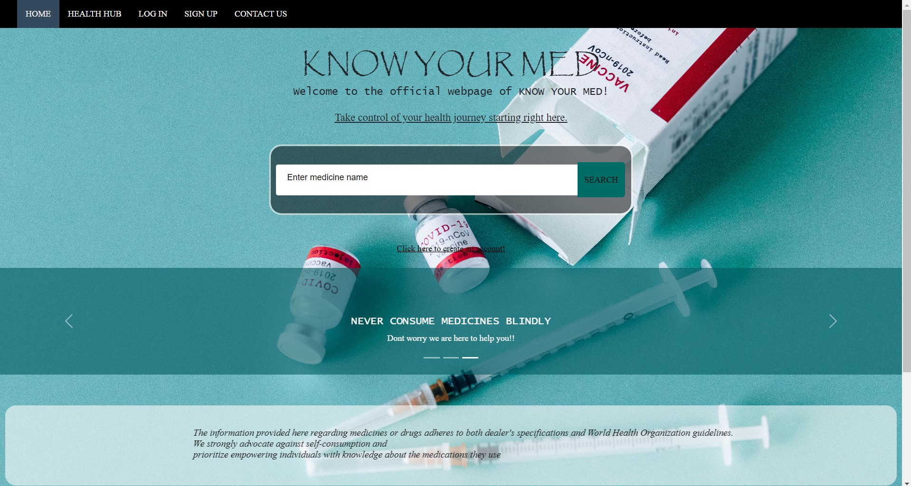

# webpage_know_your_med
A webpage using HTML, CSS, BootStrap5 with required scripting using Js
We have linked our search bar with drugs.com to showcase the drug data based on the user's input

View the webpage : 

**Steps to Run our code:** 
1. Clone our repository
3. Navigate to the project directory
4. View the code in any Text Editor 
5. Open index.html in Web Browser

**Functionality we provided to our website :**

We have designed a website that displays the info about the drugs when searched by the user

**Additional:**
  General Anatomy information
  Common Medications
  
**Connection to drugs data :** 
We connected our search bar's input value to drugs.com url using JavaScript
Refer "search_drugs.js"

Do Explore all the other pages provided in navbar!
